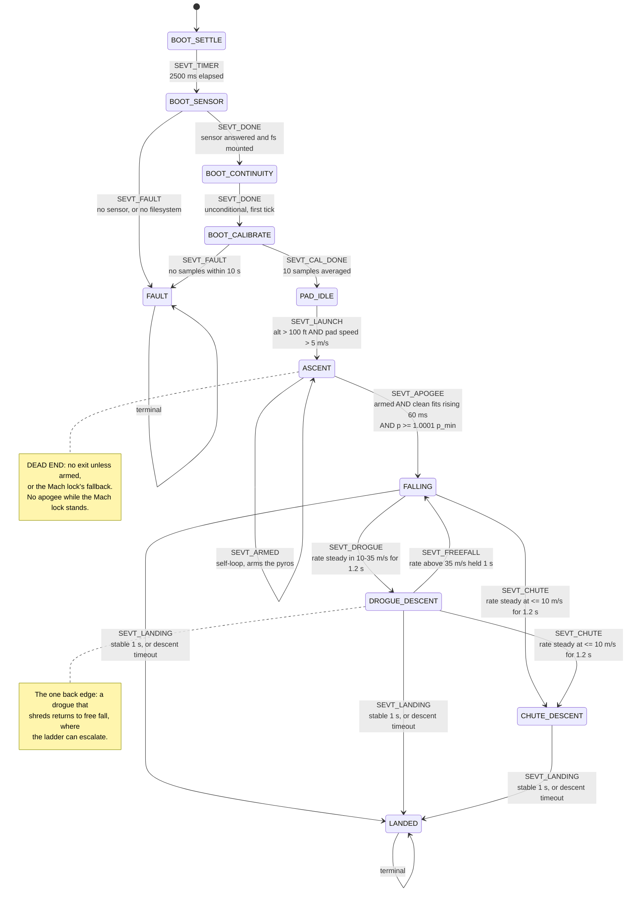

# The flight state machine

This is the machine in `src/flight_states.c`. It was first written down as it
stood, so it could be reviewed before being changed; the descent half has since
been rebuilt and this document now describes what is there.

`SPECIFICATION.md` documents four states. The code has eleven. That gap is why
this document exists.

**What changed in the descent rebuild.** The phase used to advance on *which
pyro had been commanded*: `FALLING` exited only on `pyro1_fired`, and
`DROGUE_DESCENT` only on `pyro2_fired`. A channel with no continuity, a channel
set to `NONE`, or the two firing out of order each parked the machine in a
descent state for the rest of the flight -- and because `LANDED` was reachable
only from `CHUTE_DESCENT`, `hal_log_stop()` was never called on exactly the
flights whose log mattered most. The phase now comes from the measured descent
rate holding steady, landing is detected in every descent state, and an
emergency ladder answers a canopy that was commanded and did not work.

Read with `src/flight_states.h` (the enum and the context) and
`src/flight_states.c` (the detectors, the transition table and the actions)
open beside it.

---

## How it runs

`dispatch_state()` (`flight_states.c:610`) is called once per main-loop
iteration at **100 Hz** from `main_hardware.c:199`. One detector per state, one
event per call, and a table lookup to find the transition:

```
detect = detectors[current_state]
evt    = detect(ctx, now)
if evt == SEVT_NONE: stay
find transitions[i] where from == current_state and event == evt
  run its action, return its to
```

A transition costs one tick: the new state's detector does not run until the
next call.

**On USB** (USB-01..05, DD-037): just before each dispatch, the main loop
passes `flight_set_usb_attached()` whether a host's start-of-frame number has
moved in the last 100 ms. While it has, PAD_IDLE never raises SEVT_LAUNCH,
BOOT_SENSOR takes the cold-boot verdict, no pad marker is written and nothing
is announced. Attaching plays one double chirp; detaching resumes whatever
PAD_IDLE, LANDED or FAULT would be saying. From launch to landing the call is
ignored. Test mode (`flight_set_test_mode()`, USB-08, DD-038) cancels all of
this: with it on, a board on USB is flown as on battery. It is held in RAM, so
it is off at every boot.

**The sensor produces samples at ~50 Hz**, not 100. Every flight detector
begins `if (!pp_read(&sample)) return SEVT_NONE;`, so **about half of all
dispatch calls do nothing at all**.

---

## The diagram



Every descent state can reach `LANDED`, so a flight that deployed nothing still
closes its log. `DROGUE_DESCENT --> FALLING` is the only back edge in the
machine. Nothing leaves `LANDED` or `FAULT`.

---

## Transition table

Complete. `transitions[]` has seventeen rows and this is all of them.

| From | Event | To | Action | Condition |
|---|---|---|---|---|
| BOOT_SETTLE | SEVT_TIMER | BOOT_SENSOR | — | `now - boot_timer >= 2500` |
| BOOT_SENSOR | SEVT_DONE | BOOT_CONTINUITY | — | `sensor_type != 0 && fs_ok` |
| BOOT_SENSOR | SEVT_FAULT | FAULT | `action_fault` | `sensor_type == 0` or `!fs_ok` |
| BOOT_CONTINUITY | SEVT_DONE | BOOT_CALIBRATE | `action_cal_init` | unconditional, first tick |
| BOOT_CALIBRATE | SEVT_CAL_DONE | PAD_IDLE | `action_ground_cal` | `pp_cal_done()` |
| BOOT_CALIBRATE | SEVT_FAULT | FAULT | `action_fault` | `now - boot_timer >= 10000` |
| PAD_IDLE | SEVT_LAUNCH | ASCENT | `action_launch` | `alt > 3048 cm && pad_speed > 500 cm/s` |
| ASCENT | SEVT_ARMED | **ASCENT** | `action_armed` | see arming gate below |
| ASCENT | SEVT_APOGEE | FALLING | `action_apogee` | `pyros_armed && !mach_lock && fit_clean && fit_pdot > 0`, held 60 ms, and `fit_pa >= 1.0001 * p_min_pa`; or the lock's fallback |
| FALLING | SEVT_DROGUE | DROGUE_DESCENT | — | rate settled in the drogue band |
| FALLING | SEVT_CHUTE | CHUTE_DESCENT | — | rate settled in the main band |
| DROGUE_DESCENT | SEVT_CHUTE | CHUTE_DESCENT | — | rate settled in the main band |
| DROGUE_DESCENT | SEVT_FREEFALL | FALLING | — | rate above the drogue band, held 1 s |
| FALLING | SEVT_LANDING | LANDED | `action_landing` | stable 1 s, or DD-015 timeout |
| DROGUE_DESCENT | SEVT_LANDING | LANDED | `action_landing` | stable 1 s, or DD-015 timeout |
| CHUTE_DESCENT | SEVT_LANDING | LANDED | `action_landing` | stable 1 s, or DD-015 timeout |

Events declared and **never emitted**: none. Events emitted with **no matching
row**: none. The table is complete with respect to the detectors.

---

## How a descent phase is decided

A working canopy is a descent rate that has stopped changing; a failed one is a
rate that has not. So the phase is a band plus a dwell, and never a command.

| | Band | Meaning |
|---|---|---|
| `BAND_MAIN` | <= 10 m/s | something big is out |
| `BAND_DROGUE` | 10-35 m/s | something is slowing the rocket |
| `BAND_FAST` | > 35 m/s | nothing is |

A band counts only once the rate has stayed inside it, and within a tolerance
of one value, for 1.2 s. The tolerance is a quarter of the rate with a floor of
2.5 m/s, because a drogue at 25 m/s breathes several m/s while a main at 5 m/s
does not. Free fall gains about 11.8 m/s over the dwell, which breaks that
tolerance at every rate a canopy could explain -- that is what stops the
descent through the main band just after apogee from reading as a deployed
main.

Settling in `BAND_FAST` is **not** success. A rocket at terminal velocity has a
perfectly steady rate, and that steadiness is the shredded-drogue case.

## The emergency ladder

Runs in every descent state. It answers a canopy that was **commanded and did
not work** (`pyro1_fired`, or `pyro1_refused` -- a board that could not fire
the drogue has no drogue either), and every rung acts on evidence of failure,
never on the absence of evidence of success (DD-028). A canopy opened at apogee
starts from zero and is still accelerating toward its terminal rate for
seconds; "has not settled yet" is true of a working drogue, and a ladder keyed
on it put the main out 2 s after the drogue on every flight.

1. **Retry**, once, when `pyro1_verify_fail` says the channel never opened --
   the charge did not light, the single failure a second attempt can fix -- and
   the rate has not settled under a canopy. It waits out the drogue's 2 s grace,
   or less above 90 m/s. A channel that opened fired its charge, so the canopy
   failed mechanically and re-firing an empty channel just spends altitude.
2. **Main early**, overriding its trigger, on the rocket's own evidence:
   descending faster than any drogue explains (35 m/s), **not being slowed**
   (the rate has not fallen by more than the descent tolerance), for 1 s, and
   measured only once the most recent drogue command has had its 2 s grace. A
   drogue fired into a fast descent is still decelerating inside its grace; a
   working one takes the rate below 35 m/s and never trips this.
   `main_forced` is set, `MAIN_FORCED` is logged, and `/api/status` says so.

Closed-loop, on the H73 profile: a working drogue now lets the main open at its
configured 500 ft (153 m); a drogue whose charge lit but whose canopy failed
brings the main forward 4.6 s later at 1071 m.

`try_fire_pyros()` still runs in all three descent states. The phase is a
diagnosis, not a licence to cancel the flight plan: a rocket already descending
slowly still gets the deployment its config asked for.

## The Mach lockout

A latch, not a state (`mach_lock`; DD-049, `docs/mach_lockout.md`):

- **Flag** when `-pdot > 0.029 p`, from the first sample of the rise, on the
  pad as well as in ASCENT: at 66 g the launch is declared past Mach 1. Any
  fit, or the rate over the newest 40 ms, until the first release; then a
  clean fit only. A pad flag outlives a rise that falls back, and is
  forgotten after 10 s with no launch.
- **Release** after 1 s of clean fits with `0 < -pdot < 0.022 p` and
  `pddot >= 0.0009 p`. p_min restarts at the current pressure.
- **While locked,** no apogee and no p_min.
- **Fallback:** 1 s of clean fits with `pdot > 0` and `p > p_flag` declares
  apogee (SEVT_APOGEE), and arms the pyros if arming never came.
- **Recovery** into ASCENT starts locked, flagged where it rejoined.

Each change is a flight-log event (LOCK, UNLOCK, LOCK_FALLBACK) and a
telemetry line. Arming also needs `p < 0.9965 p0` to have been seen. The
reported peak (`max_altitude`) is the height at p_min, so the locked interval
never reaches it.

## A failed sensor

The pressure layer marks a sample's fit suspect while its window holds a gap
over 250 ms or a whole window of one reading, and for a window after either
(`fit_suspect`; DD-050, SNS-PRES-10, SNS-PRES-11). A suspect fit is not clean,
and more: it cannot set the Mach flag, arm the pyros or feed the emergency
ladder, and the pressure triggers wait on it with no time limit. A window of
one reading is a stuck sensor (`sensor_stuck`, DIAG `sensor_stuck`,
SENSOR_STUCK), in any state. No sample for 0.5 s in ASCENT or a descent state
is a lost one (`sensor_lost`, DIAG `sensor_lost`, SENSOR_LOST). The DIAG bits
stay; the flight carries on when the sensor answers again.

---

## Per state

### BOOT_SETTLE (0)
A bare 2500 ms wait. Silent — nothing beeps here.

### BOOT_SENSOR (9)
Checks `sensor_type` (from `hal_pressure_sensor()`, waited for while the
sensor is still being brought up, and a missing sensor once
`SENSOR_BRINGUP_MS` has passed since boot) and `fs_ok`. Runs
before the continuity check deliberately: the continuity verdict is worth
nothing on a board that cannot measure altitude.

### BOOT_CONTINUITY (1)
Samples both channels once, stores `pyro1/2_continuity_good`, resets
`boot_timer` as the calibration deadline, returns `SEVT_DONE` immediately.
**Measures continuity but announces nothing** — that happens in PAD_IDLE.

### BOOT_CALIBRATE (2)
Polls `pp_cal_done()`. Calibration is the median of **10 raw samples**
(~200 ms at 50 Hz), so one bad reading cannot bias it (GND-CAL-03). A 10 s
timeout goes to FAULT (FLT-BOOT-13).

### PAD_IDLE (3)
Per iteration: ground-test serial poll, 1 Hz continuity resample, then a
sample if one is waiting. Every decision runs on the sample's own time
(FLT-RATE-05).

- **Pad check:** every continuity resample re-derives the pad faults
  (`DIAG_PAD_ANY`) and, when the outcome changes, says the new one -- a lead
  that lets go on the pad stops the board saying OK to fly. A disabled or
  released channel is never a fault.
- **Ground reference:** the pressure layer's 5-second rolling mean of the
  filtered pressure, frozen at launch (GND-CAL-01..04).
- **Launch:** `altitude > 3048 cm && pad_speed_cms > 500`, both on the same
  sample, held for 100 ms of sample time (FLT-LAUNCH-07). The pad speed is the
  fit's while it is clean and the two-point speed of the filtered height while
  it is not: a burst the median lets through spoils every fit for a second,
  and the two-point speed spikes only for the burst. T+0 is backdated to the
  first sample above 50 cm (`pad_rise_ms`), and the LAUNCH row carries the
  altitude at detection.
- **Pad marker:** after 10 s, written by `flight_flash_service()` inside the
  flash window -- never from the detector, which runs with the window shut.
  Not on USB; the 10 s restart when the host goes.
- **On USB:** the pad check still diagnoses, for `/api/status`, but says
  nothing, and the launch test is never raised.

### ASCENT (4)
Takes the speed from the sample's fit (DD-048), `under_thrust` from the fit's
acceleration, and tracks `max_speed_cms`, `max_altitude` and the peak: the
lowest pressure a clean fit showed (`p_min_pa`, `peak_height_cm`).

**Arming gate** (`arming_gate_met`):
```
!pyros_armed && max_speed_cms >= 1000 && vertical_speed_cms < 1000 && vertical_speed_cms >= 0
```
So: peak speed reached 10 m/s, current speed has fallen back below 10 m/s,
and is still non-negative. A narrow window late in coast.

**Apogee:** clean fits showing the pressure rising (`fit_pdot > 0`) for 60 ms
of sample time, and the fitted pressure at least 1.0001 times `p_min_pa`:
0.6-0.9 m below the peak, about 0.4 s after it. `apogee_time` is dated back
to where the fit's rate crossed zero, which is what DELAY counts from.

Arming is checked **first and returns immediately**, so arming and apogee can
never happen on the same tick — the earliest apogee is one sample (~20 ms)
after arming.

### FALLING (5) / DROGUE_DESCENT (6) / CHUTE_DESCENT (7)
Each reads the sample (which becomes `last_altitude` before any trigger is
tested), then runs `try_fire_pyros`, `check_pyro_fault`,
`check_post_fire_verify` and the emergency ladder, and differs only in its
exits: FALLING to either canopy phase, DROGUE_DESCENT to the main phase or back
to FALLING, CHUTE_DESCENT to nothing but LANDED.

AGL and FALLEN triggers compare the fit's height, which does not lag; FALLEN
measures from the peak. SPEED compares the fit's speed (PYR-MODE-05). The three
act on a clean fit, and wait out an unclean run for at most 2 s, restarting at
each charge (PYR-MODE-06): a charge pressurising the bay, or two bad readings
in a row, reads for a moment as hundreds of metres lower. A channel whose
trigger was met while the other's pulse held the common path stays due.

Landing needs all three for a continuous 1000 ms:
`|Δalt| < 100 cm`, `|speed| < 200 cm/s`, `altitude < 3000 cm`.

Or the DD-015 timeout: `landing_timeout` seconds since **apogee** (not since
main deployment) and stillness, `|speed| < 200 cm/s` held 1 s on a sensor
that has not failed -- see defect 14.

### LANDED (8) / FAULT (10)
Terminal. Flight time freezes at the landing. FAULT keeps serving HTTP and
repeats its announcement, but sends **no $PYRO sentence**: the ground-station
contract has no FAULT state and state 0 would say "ready". A `!FAULT` line with
the diagnosis goes to the UART every 5 s instead. On USB, neither the altitude
beep-out nor the fault announcement plays; both resume when the host goes.

---

## Dead ends and defects

These are properties of the machine as written, not speculation. Each one is
marked with whether the descent rebuild closed it.

### 1. FALLING never exits if pyro1 cannot fire — **observed live** — FIXED

`detect_falling` exits only on `ctx->pyro1_fired`. Three ways that never
becomes true:

- `pyro1_mode == PYRO_MODE_NONE`
- `pyro1_continuity_good == false`
- pyro2 fired first and pyro1's condition never comes true

Then: no DROGUE_DESCENT, no CHUTE_DESCENT, no LANDED, `action_landing` never
runs, **`hal_log_stop()` is never called and the flight log is never
finalised**.

**This happened on MK1C on the bench.** A false launch from pressure drift took
it through ASCENT and apogee into FALLING, where neither channel had continuity
because no igniters were connected. It sat there until power was removed, and
it blocked its own OTA while stuck.

**Fixed.** The phase comes from the rate, and every descent state can reach
`LANDED`. Covered by `test_FLT_DESC_02_ballistic_reaches_landed`, which flies
with no continuity on either channel and asserts the machine still lands.

### 2. ASCENT never exits if the arming gate is never met

`max_speed_cms` must reach 1000 cm/s (10 m/s, now of true speed). A flight
that never does stays in ASCENT forever — no apogee, no deployment, no
landing. Any flight that can trip the 100 ft launch detector climbing at
10 m/s or more passes it; the arming window no longer closes at apogee,
since descending counts (DD-050). Only a launch that barely clears 100 ft,
peaking under 35 m, is left here, and it is too low for a canopy to matter.

A false launch no longer gets here from one or two bad readings (N24: the
median, the holds, and the launch's two-point speed while the fit is
unclean). A reversion to PAD_IDLE for a board that was never armed and is
back on the ground is recorded but not scheduled:
`docs/outstanding_tasks.md`, section 9.

### 3. Continuity is frozen after the pad

`pyro1/2_continuity_good` is last written in PAD_IDLE at 1 Hz and **never
updated during flight**. A channel that read bad at T−1 s can never fire for
the whole flight, which is also dead end 1.

### 4. Nothing sequences the two channels — FIXED

`try_fire_pyros` gates each channel on its own `!pyroN_fired` — one-shot per
channel — but there is **no ordering constraint** between them. The only thing
separating them is the shared `hal_pyro_is_firing()` flag during the 500 ms
fire pulse. With pyro1 on NONE or bad continuity, **pyro2 fires first and alone
at apogee**: main chute at apogee, at full speed.

For the 500 ms that one channel is firing, the other's condition is not
deferred — it is **not evaluated at all**.

**Fixed.** Every fire site goes through `fire_channel()`, the one place a
channel is energised, which refuses while the shared element is busy
(PYR-DEPLOY-02, DD-021).

### 5. `check_refire` is unbounded — FIXED

Window 1000–1500 ms after a fire, requires `vertical_speed_cms < -3000`
(30 m/s). It **rewrites `fire_time`**, so the window reopens each time and it
can loop for as long as the rocket stays ballistic.

It does take a fresh `hal_pyro_sample()` and require `!c.open`, so it is not
firing blind. What it skips is `hal_pyro_is_firing()` — nothing stops it
commanding a fire while the other channel's 500 ms pulse is still up — and the
cached `pyroN_continuity_good` that `try_fire_pyros` uses.

Called from FALLING (`:504`) and DROGUE_DESCENT (`:532`) only. **A failed main
has no recovery at all.**

**Fixed.** `check_refire()` is retired. The retry is now the first rung of the
emergency ladder, bounded by `EMRG_MAX_REFIRE` and conditioned on evidence that
a retry can help.

### 6. Faults and verify failures are recorded and acted on by nothing — PARTLY FIXED

`check_pyro_fault` latches `pyro1/2_fault`; nothing reads it.

`check_post_fire_verify` latches `pyro1/2_verify_fail` when a channel still
reads closed 500–600 ms after firing — meaning the charge may not have gone.
That flag **is** read, but only by `verify_window_open()` (`:138`) as a latch to
stop the check repeating itself. Nothing escalates, retries, or reports it
outside the log event.

So the board detects "the charge probably did not fire" and does nothing with
the knowledge.

**Partly fixed.** `pyro1_verify_fail` now decides whether the drogue retry is
worth attempting. `pyro1_fault` / `pyro2_fault` are still recorded and acted on
by nothing.

### 7. The `dt` bug, in all four flight detectors — FIXED

```c
uint32_t dt = ts - ctx->last_sample;   /* ts is the SAMPLE timestamp */
...
ctx->last_sample = now;                /* now is the LOOP timestamp  */
```

PAD_IDLE and LANDED store `ts`; ASCENT, FALLING, DROGUE_DESCENT and
CHUTE_DESCENT store `now`. They are equal for a freshly produced sample, so the
error is usually zero — and becomes non-zero exactly when a sample was queued
(a loop overrun, a flash window), silently skewing every speed calculation at
the moments the timing is already disturbed.

**Fixed.** Every detector now stores the sample timestamp in `last_sample`
rather than the loop clock, so `dt` is measured between samples throughout.

### 8. The launch backdate was a no-op — FIXED

The ring-buffer walk matched the oldest ground sample and aged it as the newest,
so `launch_time` always came out as `now`. T+0 is now the timestamp of the first
sample above 50 cm, tracked on the pad (`pad_rise_ms`); covered by
`test_REV07_launch_backdates_to_first_rise` and `test_FLT_LAUNCH_03_backdate`,
which assert the interval rather than an inequality zero backdating satisfies.

### 9. LANDED's 1 Hz logging never fired — FIXED (N18)

`detect_landed()` compared the loop time against `last_sample`, which it moved
to every sample's time, so the difference never reached a second. The 1 Hz row
is now timed on its own, in sample time.

### 10. Altitude is clamped to >= 0 — speed no longer is

`pp_pressure_to_altitude_cm()`. Nothing can read below pad level: a landing
below the launch elevation reads as exactly 0, and AGL mode can never see a
negative altitude. **This matters for any rolling mean of altitude** — a mean
of a quantity clamped at zero that dithers around zero is biased upward by
roughly half the dither amplitude.

Speed used to be taken from the clamped altitude, so a clamp read as a speed
of zero: a glitch's decay below the pad as apogee, and the 8000 m clamp as
apogee on the way up (N26). Speed and the trigger heights now come from the
pressure fit, unclamped (SNS-ALT-04, DD-042, DD-048); only what is reported
is clamped.

### 11. `max_coast_s` was dead — REMOVED

With `beep_mode`, `log_enabled` and `buzzer_startup`, dropped from
`config_fields.h`. `telem_rate_hz` and `log_rate_hz` are now read.

### 12. The backup apogee timer cannot help in the case it was written for — REMOVED

`backup_apogee_expired` is keyed on `armed_time` and evaluated **only inside
`detect_ascent`**. A board that never arms never runs it — which is precisely
the sensor-failure case DD-013 describes. Its `backup_timer` field is a
`uint8_t` with no range validation, despite DECISIONS.md claiming 10–120 s.

**Removed** along with the `backup_timer` config field. See DD-022: a wrong
timer value fires during ascent, which is worse than the sensor failure it was
meant to cover.

### 13. No mach or plausibility gate — FIXED

Nothing rejects an implausible sample. `hal_common.c:210` logs pressure outside
30–120 kPa to the telemetry UART and **then feeds it to `pp_feed()` anyway**.
The only mitigation is the 500 ms IIR, which has a min-step anti-stall
guaranteeing it always moves at least 1 Pa toward a bad reading.

---

**Fixed.** See "The Mach lockout" above.

### 14. The landing timeout declares LANDED under a main — FIXED (N7)

The timeout now needs stillness: under 2 m/s for 1 s, on a sensor that has
not failed (FLT-LAND-07, DD-015). `test_N7_no_landing_under_main`.


The DD-015 timeout (FLT-LAND-07) needs only `landing_timeout` seconds since
apogee and `|speed| < 5 m/s`. A main canopy descends at 3-6 m/s, so on any
flight whose main opens more than 60 s after apogee -- a 5000 ft flight with a
drogue, or any main brought forward high by the ladder -- LANDED is declared
the moment the main slows the rocket, in the air. The log closes and the rest
of the descent is not recorded. Reproduced in the host simulator: LANDED at
~55 m with the main just open. The requirement itself sets the 5 m/s figure,
so this needs a requirement change; see the 2026-09-24 review resolution.

### 15. A canopy approaching its terminal rate from below can settle in the main band — FIXED (T5)

T5's fit reads the rate without the filter's lag, and drogues of 12-25 m/s
opened at apogee are never reported as the main
(`test_N12_drogue_from_below`).


A drogue opened at apogee accelerates from zero toward, say, 13 m/s. If the
rate creeps up slowly enough to stay within the 2.5 m/s tolerance for 1.2 s
while still under 10 m/s, the phase settles in the main band and the machine
enters CHUTE_DESCENT under a drogue. It affects the reported phase only; the
triggers and the ladder's main rung do not read it.

### 16. Brownout recovery never sees a sample on hardware — FIXED (N23, DD-041)

`assess_recovery()` ran in BOOT_SENSOR and read `pp_read()`, but the pressure
layer produced no samples before BOOT_CALIBRATE, so every recovery waited out
`RECOVERY_DEADLINE_MS` and booted cold. It now reads the history the layer
keeps from power-on. Two more gaps sat behind it, both hidden by tests that
primed the layer: the rejoined flight never started the pressure layer, and
it skipped BOOT_CONTINUITY, so PYR-SAFE-01 refused both channels. Either one
alone would have deployed nothing. The recovered flight now starts the layer
against the marker's ground and reads continuity first.

### 17. One sample can declare a launch or an apogee — FIXED (N24)

A single reading 11 kPa or more low declared a launch, and one high reading
in the last second of coast declared apogee early. A median of three stands
between the range check and the filter (DD-040), and launch and apogee must
hold for 100 ms and 60 ms of sample time (DD-042). On the fit (DD-048) two bad
readings in a row spoil every fit for a second: the launch reads the
two-point speed while the fit is unclean, apogee wants clean fits, and the
pressure triggers wait an unclean run out.

## What is not in the machine

- No filter on speed beyond the fit (DD-048): 0.19 m/s RMS on the pad.
- No plausibility check on a sample beyond the sensor's own range (DD-036)
  and the median of three (DD-040): two readings in a row inside 1-120 kPa
  are believed, however far they are from the last.
