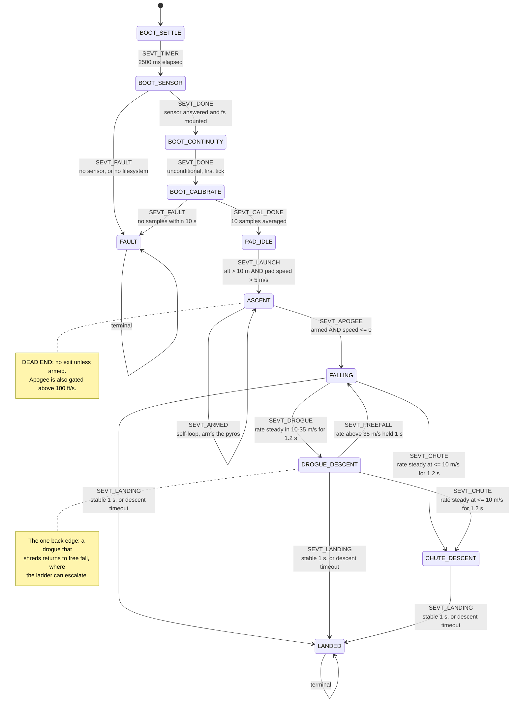

# The flight state machine

This is the machine in `src/flight_states.c`. It was first written down as it
stood, so it could be reviewed before being changed; the descent half has since
been rebuilt and this document now describes what is there.

`SPECIFICATION.md` documents four states. The code has eleven. That gap is why
this document exists.

**What changed in the descent rebuild.** The phase used to advance on *which
pyro had been commanded*: `FALLING` exited only on `pyro1_fired`, and
`DROGUE_DESCENT` only on `pyro2_fired`. A channel with no continuity, a channel
set to `NONE`, or the two firing out of order each parked the machine in a
descent state for the rest of the flight -- and because `LANDED` was reachable
only from `CHUTE_DESCENT`, `hal_log_stop()` was never called on exactly the
flights whose log mattered most. The phase now comes from the measured descent
rate holding steady, landing is detected in every descent state, and an
emergency ladder answers a canopy that was commanded and did not work.

Read with `src/flight_states.h` (the enum and the context) and
`src/flight_states.c` (the detectors, the transition table and the actions)
open beside it.

---

## How it runs

`dispatch_state()` (`flight_states.c:610`) is called once per main-loop
iteration at **100 Hz** from `main_hardware.c:199`. One detector per state, one
event per call, and a table lookup to find the transition:

```
detect = detectors[current_state]
evt    = detect(ctx, now)
if evt == SEVT_NONE: stay
find transitions[i] where from == current_state and event == evt
  run its action, return its to
```

A transition costs one tick: the new state's detector does not run until the
next call.

**The sensor produces samples at ~50 Hz**, not 100. Every flight detector
begins `if (!pp_read(&sample)) return SEVT_NONE;`, so **about half of all
dispatch calls do nothing at all**.

---

## The diagram



Every descent state can reach `LANDED`, so a flight that deployed nothing still
closes its log. `DROGUE_DESCENT --> FALLING` is the only back edge in the
machine. Nothing leaves `LANDED` or `FAULT`.

---

## Transition table

Complete. `transitions[]` has seventeen rows and this is all of them.

| From | Event | To | Action | Condition |
|---|---|---|---|---|
| BOOT_SETTLE | SEVT_TIMER | BOOT_SENSOR | — | `now - boot_timer >= 2500` |
| BOOT_SENSOR | SEVT_DONE | BOOT_CONTINUITY | — | `sensor_type != 0 && fs_ok` |
| BOOT_SENSOR | SEVT_FAULT | FAULT | `action_fault` | `sensor_type == 0` or `!fs_ok` |
| BOOT_CONTINUITY | SEVT_DONE | BOOT_CALIBRATE | `action_cal_init` | unconditional, first tick |
| BOOT_CALIBRATE | SEVT_CAL_DONE | PAD_IDLE | `action_ground_cal` | `pp_cal_done()` |
| BOOT_CALIBRATE | SEVT_FAULT | FAULT | `action_fault` | `now - boot_timer >= 10000` |
| PAD_IDLE | SEVT_LAUNCH | ASCENT | `action_launch` | `alt > 1000 cm && pad_speed > 500 cm/s` |
| ASCENT | SEVT_ARMED | **ASCENT** | `action_armed` | see arming gate below |
| ASCENT | SEVT_APOGEE | FALLING | `action_apogee` | `pyros_armed && mach gate clear && speed <= 0` |
| FALLING | SEVT_DROGUE | DROGUE_DESCENT | — | rate settled in the drogue band |
| FALLING | SEVT_CHUTE | CHUTE_DESCENT | — | rate settled in the main band |
| DROGUE_DESCENT | SEVT_CHUTE | CHUTE_DESCENT | — | rate settled in the main band |
| DROGUE_DESCENT | SEVT_FREEFALL | FALLING | — | rate above the drogue band, held 1 s |
| FALLING | SEVT_LANDING | LANDED | `action_landing` | stable 1 s, or DD-015 timeout |
| DROGUE_DESCENT | SEVT_LANDING | LANDED | `action_landing` | stable 1 s, or DD-015 timeout |
| CHUTE_DESCENT | SEVT_LANDING | LANDED | `action_landing` | stable 1 s, or DD-015 timeout |

Events declared and **never emitted**: none. Events emitted with **no matching
row**: none. The table is complete with respect to the detectors.

---

## How a descent phase is decided

A working canopy is a descent rate that has stopped changing; a failed one is a
rate that has not. So the phase is a band plus a dwell, and never a command.

| | Band | Meaning |
|---|---|---|
| `BAND_MAIN` | <= 10 m/s | something big is out |
| `BAND_DROGUE` | 10-35 m/s | something is slowing the rocket |
| `BAND_FAST` | > 35 m/s | nothing is |

A band counts only once the rate has stayed inside it, and within a tolerance
of one value, for 1.2 s. The tolerance is a quarter of the rate with a floor of
2.5 m/s, because a drogue at 25 m/s breathes several m/s while a main at 5 m/s
does not. Free fall gains about 11.8 m/s over the dwell, which breaks that
tolerance at every rate a canopy could explain -- that is what stops the
descent through the main band just after apogee from reading as a deployed
main.

Settling in `BAND_FAST` is **not** success. A rocket at terminal velocity has a
perfectly steady rate, and that steadiness is the shredded-drogue case.

## The emergency ladder

Runs in every descent state. It answers a canopy that was **commanded and did
not work**, and deliberately has no bare descent-rate trigger: a rocket in free
fall toward a trigger it has not reached yet is following the flight plan,
however fast it is going.

1. Nothing happens unless `pyro1_fired` and the rate has not settled under a
   canopy.
2. The drogue gets 2 s to bite.
3. One retry, and only if `pyro1_verify_fail` says the channel never opened --
   that means the charge did not light, the single failure a second attempt can
   fix. A channel that opened fired its charge, so the canopy failed
   mechanically and re-firing an empty channel just spends altitude.
4. Otherwise the main goes out early, overriding its configured trigger.

Above 90 m/s the grace is skipped, since waiting cannot help from there.

`try_fire_pyros()` still runs in all three descent states. The phase is a
diagnosis, not a licence to cancel the flight plan: a rocket already descending
slowly still gets the deployment its config asked for.

## The mach gate

Apogee is not declared while the rocket is ascending faster than 100 ft/s, nor
until it has been slower than that for 1 s. A flight that never exceeds it is
never gated, which is most of them.

Only an *upward* rush latches the gate. Testing the magnitude would re-latch on
the way down, where the rate climbs past the threshold again, and lock apogee
detection out for the rest of the flight. Descending fast is not a reason to
doubt that apogee happened; it is proof that it did.

The latch is fed from every ascent sample rather than from the gate test. The
gate is only consulted once the pyros are armed, and arming already requires
the rocket to have slowed below 10 m/s -- so a latch living inside the gate
could never see a speed above the threshold, and the gate would be permanently
open on exactly the flights it exists for.

---

## Per state

### BOOT_SETTLE (0)
A bare 2500 ms wait. Silent — nothing beeps here.

### BOOT_SENSOR (9)
Checks `sensor_type` (captured from `hal_pressure_init()`) and `fs_ok`. Runs
before the continuity check deliberately: the continuity verdict is worth
nothing on a board that cannot measure altitude.

### BOOT_CONTINUITY (1)
Samples both channels once, stores `pyro1/2_continuity_good`, resets
`boot_timer` as the calibration deadline, returns `SEVT_DONE` immediately.
**Measures continuity but announces nothing** — that happens in PAD_IDLE.

### BOOT_CALIBRATE (2)
Polls `pp_cal_done()`. Calibration is a plain mean of **10 raw samples**
(~200 ms at 50 Hz) with no outlier rejection and no plausibility check on the
result. A 10 s timeout goes to FAULT.

### PAD_IDLE (3)
Per iteration: ground-test serial poll (before the rate gate), 100 Hz rate
gate, 1 Hz continuity resample and the status announcement, then a sample.

- **Ground pressure tracking:** a 60-second IIR (`gnd_track_acc`, mPa
  accumulator) chases drift while idle.
- **Launch:** `altitude > 1000 cm && pad_speed_cms > 500`, both on the same
  filtered sample, **no debounce**.

### ASCENT (4)
Computes speed, tracks `under_thrust` and `max_speed_cms` and `max_altitude`.

**Arming gate** (`arming_gate_met`):
```
!pyros_armed && max_speed_cms >= 1000 && vertical_speed_cms < 1000 && vertical_speed_cms >= 0
```
So: peak filtered speed reached 10 m/s, current speed has fallen back below
10 m/s, and is still non-negative. A narrow window late in coast.

**Apogee:** one sample with `vertical_speed_cms <= 0` while armed. No
hysteresis, no confirmation, no minimum time since launch.

Arming is checked **first and returns immediately**, so arming and apogee can
never happen on the same tick — the earliest apogee is one sample (~20 ms)
after arming.

### FALLING (5)
Speed, `buf_add`, then `try_fire_pyros`, `check_pyro_fault`,
`check_post_fire_verify`, `check_refire`. Exits on `pyro1_fired`.

### DROGUE_DESCENT (6)
**Byte-for-byte identical to FALLING** except the buffer state tag and the exit
test (`pyro2_fired`).

### CHUTE_DESCENT (7)
Speed, `buf_add`, landing detection. **`try_fire_pyros` and `check_refire` are
not called here**, so nothing can fire or re-fire after pyro2.

Landing needs all three for a continuous 1000 ms:
`|Δalt| < 100 cm`, `|speed| < 200 cm/s`, `altitude < 3000 cm`.

Or the DD-015 timeout: `landing_timeout` seconds since **apogee** (not since
main deployment) with `|speed| < 500 cm/s`.

### LANDED (8) / FAULT (10)
Terminal. FAULT keeps serving HTTP and telemetry and repeats its announcement.

---

## Dead ends and defects

These are properties of the machine as written, not speculation. Each one is
marked with whether the descent rebuild closed it.

### 1. FALLING never exits if pyro1 cannot fire — **observed live** — FIXED

`detect_falling` exits only on `ctx->pyro1_fired`. Three ways that never
becomes true:

- `pyro1_mode == PYRO_MODE_NONE`
- `pyro1_continuity_good == false`
- pyro2 fired first and pyro1's condition never comes true

Then: no DROGUE_DESCENT, no CHUTE_DESCENT, no LANDED, `action_landing` never
runs, **`hal_log_stop()` is never called and the flight log is never
finalised**.

**This happened on MK1C on the bench.** A false launch from pressure drift took
it through ASCENT and apogee into FALLING, where neither channel had continuity
because no igniters were connected. It sat there until power was removed, and
it blocked its own OTA while stuck.

**Fixed.** The phase comes from the rate, and every descent state can reach
`LANDED`. Covered by `test_FLT_DESC_02_ballistic_reaches_landed`, which flies
with no continuity on either channel and asserts the machine still lands.

### 2. ASCENT never exits if the arming gate is never met

`max_speed_cms` must reach 1000 cm/s. A flight that never does stays in ASCENT
forever — no apogee, no deployment, no landing.

### 3. Continuity is frozen after the pad

`pyro1/2_continuity_good` is last written in PAD_IDLE at 1 Hz and **never
updated during flight**. A channel that read bad at T−1 s can never fire for
the whole flight, which is also dead end 1.

### 4. Nothing sequences the two channels — FIXED

`try_fire_pyros` gates each channel on its own `!pyroN_fired` — one-shot per
channel — but there is **no ordering constraint** between them. The only thing
separating them is the shared `hal_pyro_is_firing()` flag during the 500 ms
fire pulse. With pyro1 on NONE or bad continuity, **pyro2 fires first and alone
at apogee**: main chute at apogee, at full speed.

For the 500 ms that one channel is firing, the other's condition is not
deferred — it is **not evaluated at all**.

**Fixed.** Every fire site goes through `fire_channel()`, the one place a
channel is energised, which refuses while the shared element is busy
(PYR-DEPLOY-02, DD-021).

### 5. `check_refire` is unbounded — FIXED

Window 1000–1500 ms after a fire, requires `vertical_speed_cms < -3000`
(30 m/s). It **rewrites `fire_time`**, so the window reopens each time and it
can loop for as long as the rocket stays ballistic.

It does take a fresh `hal_pyro_sample()` and require `!c.open`, so it is not
firing blind. What it skips is `hal_pyro_is_firing()` — nothing stops it
commanding a fire while the other channel's 500 ms pulse is still up — and the
cached `pyroN_continuity_good` that `try_fire_pyros` uses.

Called from FALLING (`:504`) and DROGUE_DESCENT (`:532`) only. **A failed main
has no recovery at all.**

**Fixed.** `check_refire()` is retired. The retry is now the first rung of the
emergency ladder, bounded by `EMRG_MAX_REFIRE` and conditioned on evidence that
a retry can help.

### 6. Faults and verify failures are recorded and acted on by nothing — PARTLY FIXED

`check_pyro_fault` latches `pyro1/2_fault`; nothing reads it.

`check_post_fire_verify` latches `pyro1/2_verify_fail` when a channel still
reads closed 500–600 ms after firing — meaning the charge may not have gone.
That flag **is** read, but only by `verify_window_open()` (`:138`) as a latch to
stop the check repeating itself. Nothing escalates, retries, or reports it
outside the log event.

So the board detects "the charge probably did not fire" and does nothing with
the knowledge.

**Partly fixed.** `pyro1_verify_fail` now decides whether the drogue retry is
worth attempting. `pyro1_fault` / `pyro2_fault` are still recorded and acted on
by nothing.

### 7. The `dt` bug, in all four flight detectors — FIXED

```c
uint32_t dt = ts - ctx->last_sample;   /* ts is the SAMPLE timestamp */
...
ctx->last_sample = now;                /* now is the LOOP timestamp  */
```

PAD_IDLE and LANDED store `ts`; ASCENT, FALLING, DROGUE_DESCENT and
CHUTE_DESCENT store `now`. They are equal for a freshly produced sample, so the
error is usually zero — and becomes non-zero exactly when a sample was queued
(a loop overrun, a flash window), silently skewing every speed calculation at
the moments the timing is already disturbed.

**Fixed.** Every detector now stores the sample timestamp in `last_sample`
rather than the loop clock, so `dt` is measured between samples throughout.

### 8. The launch backdate is out by about half

`action_launch` scans the ring buffer back to the last sample at ≤ 50 cm and
backdates assuming **10 ms per sample**. PAD_IDLE samples arrive at ~20 ms, so
`launch_time` is backdated roughly half the true elapsed time. It also sets
`last_altitude = 0`, producing one artificially large first speed sample.

### 9. LANDED's 1 Hz logging never fires

```c
if (now - ctx->last_sample >= 1000) buf_add(...);
ctx->last_sample = sample.timestamp_ms;   /* updated every tick */
```

`last_sample` is updated unconditionally, so the difference stays near zero and
the branch is effectively unreachable after the first tick.

### 10. Altitude is clamped to >= 0

`pressure_processing.c:83-86`. Nothing can read below pad level: a landing below
the launch elevation reads as exactly 0, and AGL mode can never see a negative
altitude. **This matters for any rolling mean of altitude** — a mean of a
quantity clamped at zero that dithers around zero is biased upward by roughly
half the dither amplitude.

### 11. `max_coast_s` is dead

Declared in `config_fields.h`, parsed, serialised, round-trip tested, and read
by no flight code whatsoever.

### 12. The backup apogee timer cannot help in the case it was written for — REMOVED

`backup_apogee_expired` is keyed on `armed_time` and evaluated **only inside
`detect_ascent`**. A board that never arms never runs it — which is precisely
the sensor-failure case DD-013 describes. Its `backup_timer` field is a
`uint8_t` with no range validation, despite DECISIONS.md claiming 10–120 s.

**Removed** along with the `backup_timer` config field. See DD-022: a wrong
timer value fires during ascent, which is worse than the sensor failure it was
meant to cover.

### 13. No mach or plausibility gate — FIXED

Nothing rejects an implausible sample. `hal_common.c:210` logs pressure outside
30–120 kPa to the telemetry UART and **then feeds it to `pp_feed()` anyway**.
The only mitigation is the 500 ms IIR, which has a min-step anti-stall
guaranteeing it always moves at least 1 Pa toward a bad reading.

---

**Fixed.** See "The mach gate" above.

## What is not in the machine

- No descent-rate monitoring after drogue deployment. `DROGUE_DESCENT` has no
  speed-based exit.
- No escalation from a failed drogue to the main.
- No filter on speed. It is a raw two-point difference of the filtered
  altitude, so at ~20 ms sampling the quantisation floor is about ±50 cm/s per
  centimetre of altitude noise.
- No ground-level persistence. It is re-derived every boot and exists only in
  RAM.

---

## Context fields with no consumer

Free to repurpose, or symptoms of removed features: `pyro_firing`,
`pyro_fire_start`, `last_raw_pressure`, `filter_initialized`, `cal_count`,
`cal_sum`, `pyro1_verify_fail`, `pyro2_verify_fail`.
