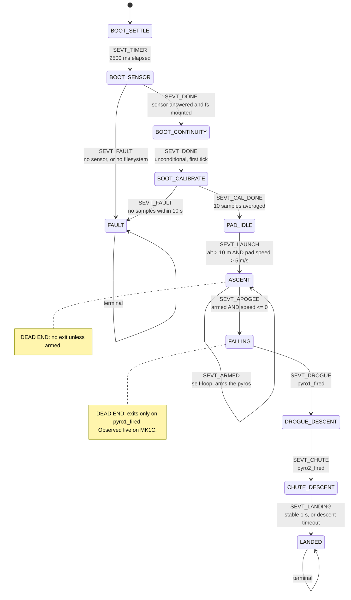

# The flight state machine, as it is

This is the machine in `src/flight_states.c` today, written down so it can be
reviewed before it is changed. It is not a description of what the machine
should do.

`SPECIFICATION.md` documents four states. The code has eleven. That gap is why
this document exists.

Read with `src/flight_states.h` (the enum and the context) and
`src/flight_states.c` (the detectors, the transition table and the actions)
open beside it.

---

## How it runs

`dispatch_state()` (`flight_states.c:610`) is called once per main-loop
iteration at **100 Hz** from `main_hardware.c:199`. One detector per state, one
event per call, and a table lookup to find the transition:

```
detect = detectors[current_state]
evt    = detect(ctx, now)
if evt == SEVT_NONE: stay
find transitions[i] where from == current_state and event == evt
  run its action, return its to
```

A transition costs one tick: the new state's detector does not run until the
next call.

**The sensor produces samples at ~50 Hz**, not 100. Every flight detector
begins `if (!pp_read(&sample)) return SEVT_NONE;`, so **about half of all
dispatch calls do nothing at all**.

---

## The diagram



Every edge is strictly forward. **No state has a back edge.** Nothing leaves
`LANDED` or `FAULT`.

---

## Transition table

Complete. `transitions[]` has twelve rows and this is all of them.

| From | Event | To | Action | Condition |
|---|---|---|---|---|
| BOOT_SETTLE | SEVT_TIMER | BOOT_SENSOR | — | `now - boot_timer >= 2500` |
| BOOT_SENSOR | SEVT_DONE | BOOT_CONTINUITY | — | `sensor_type != 0 && fs_ok` |
| BOOT_SENSOR | SEVT_FAULT | FAULT | `action_fault` | `sensor_type == 0` or `!fs_ok` |
| BOOT_CONTINUITY | SEVT_DONE | BOOT_CALIBRATE | `action_cal_init` | unconditional, first tick |
| BOOT_CALIBRATE | SEVT_CAL_DONE | PAD_IDLE | `action_ground_cal` | `pp_cal_done()` |
| BOOT_CALIBRATE | SEVT_FAULT | FAULT | `action_fault` | `now - boot_timer >= 10000` |
| PAD_IDLE | SEVT_LAUNCH | ASCENT | `action_launch` | `alt > 1000 cm && pad_speed > 500 cm/s` |
| ASCENT | SEVT_ARMED | **ASCENT** | `action_armed` | see arming gate below |
| ASCENT | SEVT_APOGEE | FALLING | `action_apogee` | `pyros_armed && speed <= 0` |
| FALLING | SEVT_DROGUE | DROGUE_DESCENT | — | `pyro1_fired` |
| DROGUE_DESCENT | SEVT_CHUTE | CHUTE_DESCENT | — | `pyro2_fired` |
| CHUTE_DESCENT | SEVT_LANDING | LANDED | `action_landing` | stable 1 s, or DD-015 timeout |

Events declared and **never emitted**: none. Events emitted with **no matching
row**: none. The table is complete with respect to the detectors.

---

## Per state

### BOOT_SETTLE (0)
A bare 2500 ms wait. Silent — nothing beeps here.

### BOOT_SENSOR (9)
Checks `sensor_type` (captured from `hal_pressure_init()`) and `fs_ok`. Runs
before the continuity check deliberately: the continuity verdict is worth
nothing on a board that cannot measure altitude.

### BOOT_CONTINUITY (1)
Samples both channels once, stores `pyro1/2_continuity_good`, resets
`boot_timer` as the calibration deadline, returns `SEVT_DONE` immediately.
**Measures continuity but announces nothing** — that happens in PAD_IDLE.

### BOOT_CALIBRATE (2)
Polls `pp_cal_done()`. Calibration is a plain mean of **10 raw samples**
(~200 ms at 50 Hz) with no outlier rejection and no plausibility check on the
result. A 10 s timeout goes to FAULT.

### PAD_IDLE (3)
Per iteration: ground-test serial poll (before the rate gate), 100 Hz rate
gate, 1 Hz continuity resample and the status announcement, then a sample.

- **Ground pressure tracking:** a 60-second IIR (`gnd_track_acc`, mPa
  accumulator) chases drift while idle.
- **Launch:** `altitude > 1000 cm && pad_speed_cms > 500`, both on the same
  filtered sample, **no debounce**.

### ASCENT (4)
Computes speed, tracks `under_thrust` and `max_speed_cms` and `max_altitude`.

**Arming gate** (`arming_gate_met`):
```
!pyros_armed && max_speed_cms >= 1000 && vertical_speed_cms < 1000 && vertical_speed_cms >= 0
```
So: peak filtered speed reached 10 m/s, current speed has fallen back below
10 m/s, and is still non-negative. A narrow window late in coast.

**Apogee:** one sample with `vertical_speed_cms <= 0` while armed. No
hysteresis, no confirmation, no minimum time since launch.

Arming is checked **first and returns immediately**, so arming and apogee can
never happen on the same tick — the earliest apogee is one sample (~20 ms)
after arming.

### FALLING (5)
Speed, `buf_add`, then `try_fire_pyros`, `check_pyro_fault`,
`check_post_fire_verify`, `check_refire`. Exits on `pyro1_fired`.

### DROGUE_DESCENT (6)
**Byte-for-byte identical to FALLING** except the buffer state tag and the exit
test (`pyro2_fired`).

### CHUTE_DESCENT (7)
Speed, `buf_add`, landing detection. **`try_fire_pyros` and `check_refire` are
not called here**, so nothing can fire or re-fire after pyro2.

Landing needs all three for a continuous 1000 ms:
`|Δalt| < 100 cm`, `|speed| < 200 cm/s`, `altitude < 3000 cm`.

Or the DD-015 timeout: `landing_timeout` seconds since **apogee** (not since
main deployment) with `|speed| < 500 cm/s`.

### LANDED (8) / FAULT (10)
Terminal. FAULT keeps serving HTTP and telemetry and repeats its announcement.

---

## Dead ends and defects

These are properties of the machine as written, not speculation.

### 1. FALLING never exits if pyro1 cannot fire — **observed live**

`detect_falling` exits only on `ctx->pyro1_fired`. Three ways that never
becomes true:

- `pyro1_mode == PYRO_MODE_NONE`
- `pyro1_continuity_good == false`
- pyro2 fired first and pyro1's condition never comes true

Then: no DROGUE_DESCENT, no CHUTE_DESCENT, no LANDED, `action_landing` never
runs, **`hal_log_stop()` is never called and the flight log is never
finalised**.

**This happened on MK1C on the bench.** A false launch from pressure drift took
it through ASCENT and apogee into FALLING, where neither channel had continuity
because no igniters were connected. It sat there until power was removed, and
it blocked its own OTA while stuck.

### 2. ASCENT never exits if the arming gate is never met

`max_speed_cms` must reach 1000 cm/s. A flight that never does stays in ASCENT
forever — no apogee, no deployment, no landing.

### 3. Continuity is frozen after the pad

`pyro1/2_continuity_good` is last written in PAD_IDLE at 1 Hz and **never
updated during flight**. A channel that read bad at T−1 s can never fire for
the whole flight, which is also dead end 1.

### 4. Nothing sequences the two channels

`try_fire_pyros` gates each channel on its own `!pyroN_fired` — one-shot per
channel — but there is **no ordering constraint** between them. The only thing
separating them is the shared `hal_pyro_is_firing()` flag during the 500 ms
fire pulse. With pyro1 on NONE or bad continuity, **pyro2 fires first and alone
at apogee**: main chute at apogee, at full speed.

For the 500 ms that one channel is firing, the other's condition is not
deferred — it is **not evaluated at all**.

### 5. `check_refire` is unbounded

Window 1000–1500 ms after a fire, requires `vertical_speed_cms < -3000`
(30 m/s). It **rewrites `fire_time`**, so the window reopens each time and it
can loop for as long as the rocket stays ballistic.

It does take a fresh `hal_pyro_sample()` and require `!c.open`, so it is not
firing blind. What it skips is `hal_pyro_is_firing()` — nothing stops it
commanding a fire while the other channel's 500 ms pulse is still up — and the
cached `pyroN_continuity_good` that `try_fire_pyros` uses.

Called from FALLING (`:504`) and DROGUE_DESCENT (`:532`) only. **A failed main
has no recovery at all.**

### 6. Faults and verify failures are recorded and acted on by nothing

`check_pyro_fault` latches `pyro1/2_fault`; nothing reads it.

`check_post_fire_verify` latches `pyro1/2_verify_fail` when a channel still
reads closed 500–600 ms after firing — meaning the charge may not have gone.
That flag **is** read, but only by `verify_window_open()` (`:138`) as a latch to
stop the check repeating itself. Nothing escalates, retries, or reports it
outside the log event.

So the board detects "the charge probably did not fire" and does nothing with
the knowledge.

### 7. The `dt` bug, in all four flight detectors

```c
uint32_t dt = ts - ctx->last_sample;   /* ts is the SAMPLE timestamp */
...
ctx->last_sample = now;                /* now is the LOOP timestamp  */
```

PAD_IDLE and LANDED store `ts`; ASCENT, FALLING, DROGUE_DESCENT and
CHUTE_DESCENT store `now`. They are equal for a freshly produced sample, so the
error is usually zero — and becomes non-zero exactly when a sample was queued
(a loop overrun, a flash window), silently skewing every speed calculation at
the moments the timing is already disturbed.

### 8. The launch backdate is out by about half

`action_launch` scans the ring buffer back to the last sample at ≤ 50 cm and
backdates assuming **10 ms per sample**. PAD_IDLE samples arrive at ~20 ms, so
`launch_time` is backdated roughly half the true elapsed time. It also sets
`last_altitude = 0`, producing one artificially large first speed sample.

### 9. LANDED's 1 Hz logging never fires

```c
if (now - ctx->last_sample >= 1000) buf_add(...);
ctx->last_sample = sample.timestamp_ms;   /* updated every tick */
```

`last_sample` is updated unconditionally, so the difference stays near zero and
the branch is effectively unreachable after the first tick.

### 10. Altitude is clamped to >= 0

`pressure_processing.c:83-86`. Nothing can read below pad level: a landing below
the launch elevation reads as exactly 0, and AGL mode can never see a negative
altitude. **This matters for any rolling mean of altitude** — a mean of a
quantity clamped at zero that dithers around zero is biased upward by roughly
half the dither amplitude.

### 11. `max_coast_s` is dead

Declared in `config_fields.h`, parsed, serialised, round-trip tested, and read
by no flight code whatsoever.

### 12. The backup apogee timer cannot help in the case it was written for

`backup_apogee_expired` is keyed on `armed_time` and evaluated **only inside
`detect_ascent`**. A board that never arms never runs it — which is precisely
the sensor-failure case DD-013 describes. Its `backup_timer` field is a
`uint8_t` with no range validation, despite DECISIONS.md claiming 10–120 s.

### 13. No mach or plausibility gate

Nothing rejects an implausible sample. `hal_common.c:210` logs pressure outside
30–120 kPa to the telemetry UART and **then feeds it to `pp_feed()` anyway**.
The only mitigation is the 500 ms IIR, which has a min-step anti-stall
guaranteeing it always moves at least 1 Pa toward a bad reading.

---

## What is not in the machine

- No descent-rate monitoring after drogue deployment. `DROGUE_DESCENT` has no
  speed-based exit.
- No escalation from a failed drogue to the main.
- No filter on speed. It is a raw two-point difference of the filtered
  altitude, so at ~20 ms sampling the quantisation floor is about ±50 cm/s per
  centimetre of altitude noise.
- No ground-level persistence. It is re-derived every boot and exists only in
  RAM.

---

## Context fields with no consumer

Free to repurpose, or symptoms of removed features: `pyro_firing`,
`pyro_fire_start`, `last_raw_pressure`, `filter_initialized`, `cal_count`,
`cal_sum`, `pyro1_verify_fail`, `pyro2_verify_fail`.
