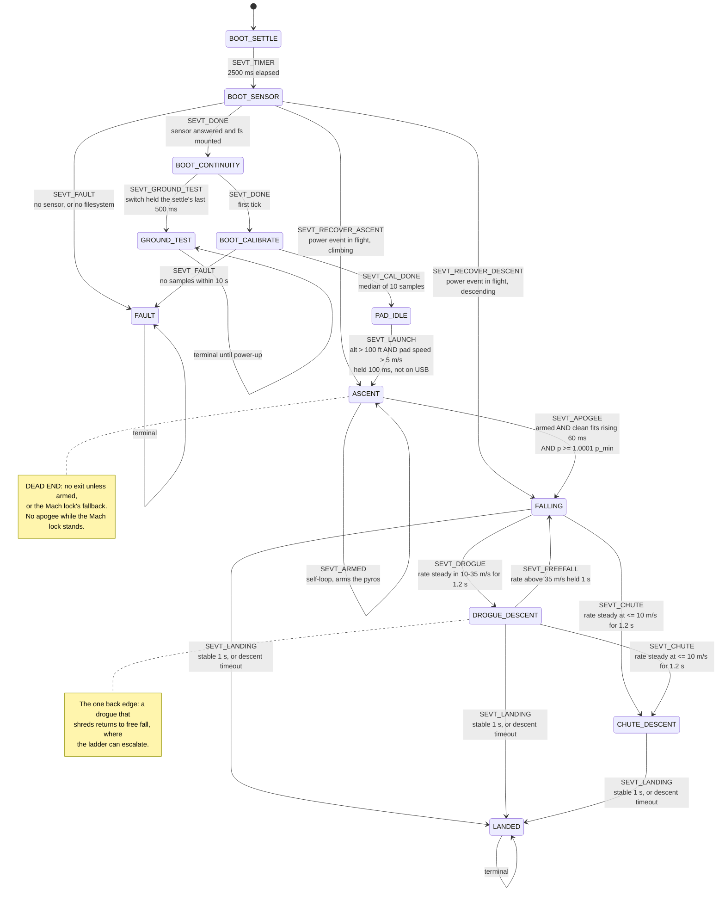

# The flight state machine

This is the machine in `src/flight_states.c`, as it is.

`SPECIFICATION.md` carries a sketch and names this document the authority. The
code has twelve states.

**The descent.** The phase comes from the measured descent rate holding
steady, never from which pyro was commanded (DD-023): a channel with no
continuity, a channel set to `NONE`, or the two firing out of order cannot
park the machine. Landing is detected in every descent state, so
`hal_log_stop()` runs on every flight, and an emergency ladder answers a canopy
that was commanded and did not work (DD-028).

Read with `src/flight_states.h` (the enum and the context) and
`src/flight_states.c` (the detectors, the transition table and the actions)
open beside it.

---

## How it runs

`dispatch_state()` (`flight_states.c:1545`) is called once per main-loop
iteration at **50 Hz** (`src/loop_period.h`, DD-065). One detector per state, one
event per call, and a table lookup to find the transition:

```
detect = detectors[current_state]
evt    = detect(ctx, now)
if evt == SEVT_NONE: stay
find transitions[i] where from == current_state and event == evt
  run its action, return its to
```

A transition costs one tick: the new state's detector does not run until the
next call.

**On USB** (USB-01..05, DD-037): just before each dispatch, the main loop
passes `flight_set_usb_attached()` whether a host's start-of-frame number has
moved in the last 100 ms. While it has, PAD_IDLE never raises SEVT_LAUNCH,
BOOT_SENSOR takes the cold-boot verdict, no pad marker is written and nothing
is announced. Attaching plays one double chirp; detaching resumes whatever
PAD_IDLE, LANDED or FAULT would be saying. From launch to landing the call is
ignored. Test mode (`flight_set_test_mode()`, USB-08, DD-038; `POST
/api/test_mode/on|off`) cancels all of this: with it on, a board on USB is
flown as on battery. It is held in RAM, so it is off at every boot, and it too
is ignored from launch to landing. GROUND_TEST runs its procedure on USB as on
battery, and the attach chirp does not take its buzzer (GND-TEST-06).

**The sensor produces one sample a loop**, 50 a second on the MS5607 and the
BMP280 alike (DD-066, DD-067). Every flight detector reads one with
`pp_read()` and returns `SEVT_NONE` without one, so a loop with no new sample
-- a conversion a flash operation ran beside is discarded (DD-068) -- decides
nothing. Samples queued behind a late loop are taken one a call, on their own
timestamps.

**Telemetry** follows the state, from `flight_update_outputs()`: a $PYRO
sentence once a second in PAD_IDLE and LANDED, and in flight at
`telem_rate_hz` (10 by default, 50 at most); none in the boot states, FAULT or
GROUND_TEST (TEL-03..05, DD-031). `state_to_telem_id()` maps the six states
that send one onto the ground station's codes 0-5 (TEL-07).

---

## The diagram


```mermaid
stateDiagram-v2
    direction TB
    [*] --> BOOT_SETTLE

    BOOT_SETTLE --> BOOT_SENSOR: SEVT_TIMER<br/>2500 ms elapsed
    BOOT_SENSOR --> BOOT_CONTINUITY: SEVT_DONE<br/>sensor answered and fs mounted
    BOOT_SENSOR --> FAULT: SEVT_FAULT<br/>no sensor, or no filesystem
    BOOT_SENSOR --> ASCENT: SEVT_RECOVER_ASCENT<br/>power event in flight, climbing
    BOOT_SENSOR --> FALLING: SEVT_RECOVER_DESCENT<br/>power event in flight, descending
    BOOT_CONTINUITY --> BOOT_CALIBRATE: SEVT_DONE<br/>first tick
    BOOT_CONTINUITY --> GROUND_TEST: SEVT_GROUND_TEST<br/>switch held the settle's last 500 ms
    BOOT_CALIBRATE --> PAD_IDLE: SEVT_CAL_DONE<br/>median of 10 samples
    BOOT_CALIBRATE --> FAULT: SEVT_FAULT<br/>no samples within 10 s

    PAD_IDLE --> ASCENT: SEVT_LAUNCH<br/>alt > 100 ft AND pad speed > 5 m/s<br/>held 100 ms, not on USB
    ASCENT --> ASCENT: SEVT_ARMED<br/>self-loop, arms the pyros
    ASCENT --> FALLING: SEVT_APOGEE<br/>armed AND clean fits rising 60 ms<br/>AND p >= 1.0001 p_min

    FALLING --> DROGUE_DESCENT: SEVT_DROGUE<br/>rate steady in 10-35 m/s for 1.2 s
    FALLING --> CHUTE_DESCENT: SEVT_CHUTE<br/>rate steady at <= 10 m/s for 1.2 s
    DROGUE_DESCENT --> CHUTE_DESCENT: SEVT_CHUTE<br/>rate steady at <= 10 m/s for 1.2 s
    DROGUE_DESCENT --> FALLING: SEVT_FREEFALL<br/>rate above 35 m/s held 1 s

    FALLING --> LANDED: SEVT_LANDING<br/>stable 1 s, or descent timeout
    DROGUE_DESCENT --> LANDED: SEVT_LANDING<br/>stable 1 s, or descent timeout
    CHUTE_DESCENT --> LANDED: SEVT_LANDING<br/>stable 1 s, or descent timeout

    FAULT --> FAULT: terminal
    LANDED --> LANDED: terminal
    GROUND_TEST --> GROUND_TEST: terminal until power-up

    note right of ASCENT
        DEAD END: no exit unless armed,
        or the Mach lock's fallback.
        No apogee while the Mach lock stands.
    end note
    note right of DROGUE_DESCENT
        The one back edge: a drogue that
        shreds returns to free fall, where
        the ladder can escalate.
    end note
```

Every descent state can reach `LANDED`, so a flight that deployed nothing still
closes its log. `DROGUE_DESCENT --> FALLING` is the only back edge in the
machine. Nothing leaves `LANDED`, `FAULT` or `GROUND_TEST`.

---

## Transition table

Complete. `transitions[]` has nineteen rows and this is all of them.

| From | Event | To | Action | Condition |
|---|---|---|---|---|
| BOOT_SETTLE | SEVT_TIMER | BOOT_SENSOR | — | `now - boot_timer >= 2500` |
| BOOT_SENSOR | SEVT_DONE | BOOT_CONTINUITY | — | `sensor_type != 0 && fs_ok`, and no flight to rejoin |
| BOOT_SENSOR | SEVT_RECOVER_ASCENT | ASCENT | — | a power event in flight, climbing (brownout.h) |
| BOOT_SENSOR | SEVT_RECOVER_DESCENT | FALLING | `action_recovered_descent` | a power event in flight, descending |
| BOOT_SENSOR | SEVT_FAULT | FAULT | `action_fault` | `sensor_type == 0` or `!fs_ok` |
| BOOT_CONTINUITY | SEVT_DONE | BOOT_CALIBRATE | `action_cal_init` | first tick, no ground test |
| BOOT_CONTINUITY | SEVT_GROUND_TEST | GROUND_TEST | `action_ground_test` | `gt_requested`: the switch held 500 ms at the settle's end [GND-TEST-05] |
| BOOT_CALIBRATE | SEVT_CAL_DONE | PAD_IDLE | `action_ground_cal` | `pp_cal_done()` |
| BOOT_CALIBRATE | SEVT_FAULT | FAULT | `action_fault` | `now - boot_timer >= 10000` |
| PAD_IDLE | SEVT_LAUNCH | ASCENT | `action_launch` | `alt > 3048 cm && pad_speed > 500 cm/s`, held 100 ms, not grounded on USB |
| ASCENT | SEVT_ARMED | **ASCENT** | `action_armed` | see arming gate below |
| ASCENT | SEVT_APOGEE | FALLING | `action_apogee` | `pyros_armed && !mach_lock && fit_clean && fit_pdot > 0`, held 60 ms, and `fit_pa >= 1.0001 * p_min_pa`; or the lock's fallback |
| FALLING | SEVT_DROGUE | DROGUE_DESCENT | — | rate settled in the drogue band |
| FALLING | SEVT_CHUTE | CHUTE_DESCENT | — | rate settled in the main band |
| DROGUE_DESCENT | SEVT_CHUTE | CHUTE_DESCENT | — | rate settled in the main band |
| DROGUE_DESCENT | SEVT_FREEFALL | FALLING | — | rate above the drogue band, held 1 s |
| FALLING | SEVT_LANDING | LANDED | `action_landing` | stable 1 s, or DD-015 timeout |
| DROGUE_DESCENT | SEVT_LANDING | LANDED | `action_landing` | stable 1 s, or DD-015 timeout |
| CHUTE_DESCENT | SEVT_LANDING | LANDED | `action_landing` | stable 1 s, or DD-015 timeout |

Events declared and **never emitted**: none. Events emitted with **no matching
row**: none. The table is complete with respect to the detectors.

---

## How a descent phase is decided

A working canopy is a descent rate that has stopped changing; a failed one is a
rate that has not. So the phase is a band plus a dwell, and never a command.

| | Band | Meaning |
|---|---|---|
| `BAND_MAIN` | <= 10 m/s | something big is out |
| `BAND_DROGUE` | 10-35 m/s | something is slowing the rocket |
| `BAND_FAST` | > 35 m/s | nothing is |

A band counts only once the rate has stayed inside it, and within a tolerance
of one value, for 1.2 s. The tolerance is a quarter of the rate with a floor of
2.5 m/s, because a drogue at 25 m/s breathes several m/s while a main at 5 m/s
does not. Free fall gains about 11.8 m/s over the dwell, which breaks that
tolerance at every rate a canopy could explain -- that is what stops the
descent through the main band just after apogee from reading as a deployed
main.

Settling in `BAND_FAST` is **not** success. A rocket at terminal velocity has a
perfectly steady rate, and that steadiness is the shredded-drogue case.

## The emergency ladder

Runs in every descent state. It answers a canopy that was **commanded and did
not work** (`pyro1_fired`, or `pyro1_refused` -- a board that could not fire
the drogue has no drogue either), and every rung acts on evidence of failure,
never on the absence of evidence of success (DD-028). A canopy opened at apogee
starts from zero and is still accelerating toward its terminal rate for
seconds; "has not settled yet" is true of a working drogue, and a ladder keyed
on it put the main out 2 s after the drogue on every flight.

1. **Retry**, once, when `pyro1_verify_fail` says the channel never opened --
   the charge did not light, the single failure a second attempt can fix -- and
   the rate has not settled under a canopy. It waits out the drogue's 2 s grace,
   or less above 90 m/s. A channel that opened fired its charge, so the canopy
   failed mechanically and re-firing an empty channel just spends altitude.
2. **Main early**, overriding its trigger, on the rocket's own evidence:
   descending faster than any drogue explains (35 m/s), **not being slowed**
   (the rate has not fallen by more than the descent tolerance), for 1 s, and
   measured only once the most recent drogue command has had its 2 s grace. A
   drogue fired into a fast descent is still decelerating inside its grace; a
   working one takes the rate below 35 m/s and never trips this.
   `main_forced` is set, `MAIN_FORCED` is logged, and `/api/status` says so.

Closed-loop, on the H73 profile: a working drogue lets the main open at its
configured 500 ft (153 m); a drogue whose charge lit but whose canopy failed
brings the main forward 4.6 s later at 1071 m.

`try_fire_pyros()` runs in all three descent states. The phase is a
diagnosis, not a licence to cancel the flight plan: a rocket already descending
slowly still gets the deployment its config asked for.

## The Mach lockout

A latch, not a state (`mach_lock`; DD-049, `docs/mach_lockout.md`):

- **Flag** when `-pdot > 0.029 p`, from the first sample of the rise, on the
  pad as well as in ASCENT: at 66 g the launch is declared past Mach 1. Any
  fit, or the rate over the newest 40 ms, until the first release; then a
  clean fit only. A pad flag outlives a rise that falls back, and is
  forgotten after 10 s with no launch.
- **Release** after 1 s of clean fits with `0 < -pdot < 0.022 p` and
  `pddot >= 0.0009 p`. p_min restarts at the current pressure.
- **While locked,** no apogee and no p_min.
- **Fallback:** 1 s of clean fits with `pdot > 0` and `p > p_flag` declares
  apogee (SEVT_APOGEE), and arms the pyros if arming never came.
- **Recovery** into ASCENT starts locked, flagged where it rejoined.

Each change is a flight-log event (LOCK, UNLOCK, LOCK_FALLBACK) and a
telemetry line. Arming also needs `p < 0.9965 p0` to have been seen. The
reported peak (`max_altitude`) is the height at p_min, so the locked interval
never reaches it.

## A failed sensor

The pressure layer marks a sample's fit suspect while its window holds a gap
over 250 ms or a whole window of one reading, and for a window after either
(`fit_suspect`; DD-050, SNS-PRES-10, SNS-PRES-11). A suspect fit is not clean,
and more: it cannot set the Mach flag, arm the pyros or feed the emergency
ladder, and the pressure triggers wait on it with no time limit. A window of
one reading is a stuck sensor (`sensor_stuck`, DIAG `sensor_stuck`,
SENSOR_STUCK), on the pad and in flight. No sample for 0.5 s in ASCENT or a
descent state is a lost one (`sensor_lost`, DIAG `sensor_lost`, SENSOR_LOST).
The DIAG bits stay; the flight carries on when the sensor answers again.

---

## Per state

### BOOT_SETTLE (0)
A 2500 ms wait, while the sensor is brought up a step a loop (DD-053). It
watches the ground test switch: closed for the settle's last 500 ms
(`GT_BOOT_HOLD_MS`), it asks for GROUND_TEST (GND-TEST-05). Silent — nothing
beeps here.

### BOOT_SENSOR (9)
Checks `sensor_type` (from `hal_pressure_sensor()`, waited for while the
sensor is still being brought up, and a missing sensor once
`SENSOR_BRINGUP_MS` has passed since boot) and `fs_ok`. Runs
before the continuity check deliberately: the continuity verdict is worth
nothing on a board that cannot measure altitude.

Then `assess_recovery()` asks whether this boot rejoins a flight
(FLT-BROWN-02, DD-026, DD-041). With a valid pad marker, off USB, it reads the
pressure history kept from power-on: the median of the newest 250 ms against
the median of a 250 ms window ending 350 ms earlier, as heights above the
marker's ground. It waits for 600 ms of history, up to 4 s since boot.
`brownout_assess()` rejoins a power event more than 30 m up and moving at
5 m/s or more: climbing, into ASCENT, locked; descending, into FALLING, armed.
Anything else is a cold boot.

### BOOT_CONTINUITY (1)
Samples both channels once, stores `pyro1/2_continuity_good`, resets
`boot_timer` as the calibration deadline, and returns at once: `SEVT_DONE`, or
`SEVT_GROUND_TEST` when the settle saw the switch held.
**Measures continuity but announces nothing** — that happens in PAD_IDLE.

### BOOT_CALIBRATE (2)
Polls `pp_cal_done()`. Calibration is the median of **10 raw samples**
(~200 ms at 50 Hz), so one bad reading cannot bias it (GND-CAL-03). A 10 s
timeout goes to FAULT (FLT-BOOT-13).

### PAD_IDLE (3)
Per iteration: ground-test serial poll, 1 Hz continuity resample, then a
sample if one is waiting. Every decision runs on the sample's own time
(FLT-RATE-05).

- **Pad check:** every continuity resample re-derives the pad faults
  (`DIAG_PAD_ANY`) and, when the outcome changes, says the new one -- a lead
  that lets go on the pad stops the board saying OK to fly. A disabled or
  released channel is never a fault.
- **Ground reference:** the pressure layer's 5-second rolling mean of the
  filtered pressure, frozen at launch from before T+0 (GND-CAL-01..04). Five
  seconds of rejected samples with the board still re-seed it (GND-CAL-06,
  DD-045), and restart the pad marker's dwell.
- **Launch:** `altitude > 3048 cm && pad_speed_cms > 500`, both on the same
  sample, held for 100 ms of sample time (FLT-LAUNCH-07). The pad speed is the
  fit's while it is clean and the two-point speed of the filtered height while
  it is not: a burst the median lets through spoils every fit for a second,
  and the two-point speed spikes only for the burst. T+0 is backdated to the
  first sample above 50 cm (`pad_rise_ms`), and the LAUNCH row carries the
  altitude at detection.
- **Pad marker:** after 10 s, written by `flight_flash_service()` inside the
  flash window -- never from the detector, which runs with the window shut.
  Not on USB; the 10 s restart when the host goes, and after a ground re-seed.
- **On USB:** the pad check still diagnoses, for `/api/status`, but says
  nothing, and the launch test is never raised.

### ASCENT (4)
Takes the speed from the sample's fit (DD-048), `under_thrust` from the fit's
acceleration, and tracks `max_speed_cms`, `max_altitude` and the peak: the
lowest pressure a clean fit showed (`p_min_pa`, `peak_height_cm`).

**Arming gate** (`arming_gate_met`):
```
!pyros_armed && arm_height && !fit_suspect && max_speed_cms >= 1000 && vertical_speed_cms < 1000
```
So: peak speed reached 10 m/s and has fallen back below it, the rocket has
been above about 30 m (`p < 0.9965 p0`, FLT-MACH-06), and the sensor has not
failed. Descending counts (DD-050): the window opens late in coast and does not
close at apogee.

**Apogee:** clean fits showing the pressure rising (`fit_pdot > 0`) for 60 ms
of sample time, and the fitted pressure at least 1.0001 times `p_min_pa`:
0.6-0.9 m below the peak, about 0.4 s after it. `apogee_time` is dated back
to where the fit's rate crossed zero, which is what DELAY counts from.

The Mach lockout runs first, then arming, then apogee, and each returns
immediately. Arming and apogee never happen on the same tick, and since the
apogee hold counts only armed samples, the earliest apogee is 60 ms of samples
after arming. The Mach fallback is the exception: it arms and declares apogee
on one tick.

### FALLING (5) / DROGUE_DESCENT (6) / CHUTE_DESCENT (7)
Each reads the sample (which becomes `last_altitude` before any trigger is
tested), then runs `try_fire_pyros`, `check_pyro_fault`,
`check_post_fire_verify` and the emergency ladder, and differs only in its
exits: FALLING to either canopy phase, DROGUE_DESCENT to the main phase or back
to FALLING, CHUTE_DESCENT to nothing but LANDED.

AGL and FALLEN triggers compare the fit's height, which does not lag; FALLEN
measures from the peak. SPEED compares the fit's speed (PYR-MODE-05). The three
act on a clean fit, and wait out an unclean run for at most 2 s, restarting at
each charge (PYR-MODE-06): a charge pressurising the bay, or two bad readings
in a row, reads for a moment as hundreds of metres lower. Within 2 s of a
charge, an unclean fit that reads no lower than the last clean fit carried on
ballistically is believed at once. A suspect fit is never believed. DELAY needs
no fit. A channel whose trigger was met while the other's pulse held the
common path stays due.

Landing needs all three for a continuous 1000 ms:
`|Δalt| < 100 cm`, `|speed| < 200 cm/s`, `altitude < 3000 cm`.

Or the DD-015 timeout: `landing_timeout` seconds since **apogee** (not since
main deployment) and stillness, `|speed| < 200 cm/s` held 1 s on a sensor
that has not failed -- see defect 14.

### GROUND_TEST (12)
Entered from BOOT_CONTINUITY when the ground test switch was closed through
the end of the power-up settle, once the sensor and continuity have been
checked; a recovery leaves BOOT_SENSOR for the flight first, so it always
wins, and a failed sensor or filesystem goes to FAULT. Terminal until the next
power-up: no launch detection, no flight log, no $PYRO sentence and no pad
announcement. Continuity is still sampled once a second, quietly: MK1C fires
only a channel its tracking test has seen present. `ground_test_seq.c` runs the
procedure -- the alert, the countdown, pyro 1 at zero, the tone and a
second countdown, pyro 2 at zero, the all-clear -- and `!GT` lines report
each step on the UART [GND-TEST-05..11, DD-071]. A channel is enabled with a
mode other than NONE and its pads not released to Lua. Each fire goes through
`flight_pyro_energise()`, the same interlock as flight (PYR-DEPLOY-02); a
refusal is reported and the procedure goes on.

### LANDED (8) / FAULT (10)
Terminal. Flight time freezes at the landing. LANDED keeps a row a second in
the ring (FLT-RATE-04), and once the log has flushed, `flight_flash_service()`
spends the pad marker, so no later power-up rejoins this flight
(FLT-BROWN-04). FAULT keeps serving HTTP and repeats its announcement, but
sends **no $PYRO sentence**: the ground-station contract has no FAULT state
and state 0 would say "ready" (DD-031). A `!FAULT` line with the diagnosis goes
to the UART every 5 s instead. On USB, neither the altitude beep-out nor the
fault announcement plays; both resume when the host goes.

---

## Dead ends and defects

These are properties of the machine, not speculation. Each is marked with its
status; a fixed one says what closes it and the test that holds it.

### 1. FALLING never exits if pyro1 cannot fire — **observed live** — FIXED

No descent state waits on a channel. The phase comes from the rate (DD-023),
and every descent state can reach `LANDED`, so `action_landing` runs and
`hal_log_stop()` finalises the log whether or not anything fired: pyro1 on
NONE, pyro1 without continuity, or pyro2 first.
`test_FLT_DESC_02_ballistic_reaches_landed` flies with no continuity on either
channel and asserts the machine still lands.

Observed on MK1C on the bench: a false launch from pressure drift took it
through ASCENT and apogee into FALLING with no igniters connected, where it sat
until power was removed and blocked its own OTA.

### 2. ASCENT never exits if the arming gate is never met

`max_speed_cms` must reach 1000 cm/s (10 m/s, of true speed). A flight
that never does stays in ASCENT forever — no apogee, no deployment, no
landing. Any flight that can trip the 100 ft launch detector climbing at
10 m/s or more passes it; the arming window stays open past apogee,
since descending counts (DD-050). Only a launch that barely clears 100 ft,
peaking under 35 m, is left here, and it is too low for a canopy to matter.

A false launch does not get here from one or two bad readings (N24: the
median, the holds, and the launch's two-point speed while the fit is
unclean). A reversion to PAD_IDLE for a board that was never armed and is
back on the ground is recorded but not scheduled:
`docs/outstanding_tasks.md`, section 9.

### 3. Continuity is frozen after the pad

`pyro1/2_continuity_good` is last written in PAD_IDLE at 1 Hz, or by a
recovery's one read, and **never updated during flight**. A channel that read
bad at T−1 s can never fire for the whole flight. The machine does not wait on
it (defect 1).

### 4. Nothing sequences the two channels — FIXED

Every flight fire goes through `fire_channel()`, and it and the ground test go
through `flight_pyro_energise()`, the one place a channel is energised, which
refuses while the shared element is busy (PYR-DEPLOY-02). A channel whose
trigger was met meanwhile stays due and fires when the other's pulse ends.
Otherwise each channel fires on its own trigger, and both may deploy on one
event (DD-021).

### 5. An unbounded refire — FIXED

The one retry is the emergency ladder's first rung: bounded by
`EMRG_MAX_REFIRE` (one), taken only when the drogue's post-fire continuity says
its charge never lit (PYR-REFIRE-01, PYR-REFIRE-02, DD-028), and fired through
`fire_channel()` like any other. A failed main has no retry.

### 6. Faults and verify failures are recorded and acted on by nothing — PARTLY FIXED

`check_pyro_fault` latches `pyro1/2_fault` and logs it. `check_post_fire_verify`
latches `pyro1/2_verify_fail` when a channel still reads closed 500–600 ms
after firing -- the charge may not have gone -- and logs NOPEN.

**Partly fixed.** `pyro1_verify_fail` decides whether the drogue retry is worth
attempting. `pyro2_verify_fail`, `pyro1_fault` and `pyro2_fault` are logged and
acted on by nothing, and `/api/status` does not report them.

### 7. The `dt` bug, in all four flight detectors — FIXED

Every detector stores the sample's timestamp in `last_sample`, never the loop
clock, so every speed short of a fit is taken between samples, and a sample
queued behind a late loop keeps its own time (FLT-RATE-05).

### 8. The launch backdate was a no-op — FIXED

T+0 is the timestamp of the first sample above 50 cm, tracked on the pad
(`pad_rise_ms`, FLT-LAUNCH-03). `test_REV07_launch_backdates_to_first_rise` and
`test_FLT_LAUNCH_03_backdate` assert the interval, which no zero backdate
satisfies.

### 9. LANDED's 1 Hz logging never fired — FIXED (N18)

`detect_landed()` times the 1 Hz row on its own (`landed_row_ms`), in sample
time, apart from `last_sample`, which every sample moves (FLT-RATE-04).
`test_N18_landed_logs_once_a_second`.

### 10. Altitude is clamped to >= 0 — speed is not

`pp_pressure_to_altitude_cm()`. Nothing reported can read below pad level: a
landing below the launch elevation reads as exactly 0, and AGL mode can never
see a negative altitude. **This matters for any rolling mean of altitude** — a
mean of a quantity clamped at zero that dithers around zero is biased upward by
roughly half the dither amplitude.

Speed and the trigger heights come from the pressure fit, unclamped, and the
speed short of a fit from the unclamped height (SNS-ALT-04, DD-042, DD-048,
N26): a clamp never reads as a speed of zero. Only what is reported is clamped,
to 0-8000 m (SNS-ALT-02, SNS-ALT-03).

### 11. `max_coast_s` was dead — REMOVED

Not in `config_fields.h`, and nor are `beep_mode`, `log_enabled` and
`buzzer_startup`. Every key there is read (DD-030): `telem_rate_hz` sets the
in-flight telemetry rate (TEL-03), and `log_rate` the log's plan (DD-064).

### 12. The backup apogee timer cannot help in the case it was written for — REMOVED

**Removed**, with the `backup_timer` config field (DD-022). No timer may
declare apogee: a wrong value fires during ascent, which is worse than the
sensor failure it would cover (DD-013). A board whose sensor fails never arms,
so a timer keyed on arming cannot cover that failure anyway.

### 13. No mach or plausibility gate — FIXED

The Mach lockout gates apogee (above; DD-049). A reading outside 1-120 kPa is
refused before the pressure layer (DD-036), and a median of three stops a
single bad one (DD-040); see "What is not in the machine" for what remains.

### 14. The landing timeout declares LANDED under a main — FIXED (N7)

The timeout needs stillness: under 2 m/s for 1 s, on a sensor that has
not failed (FLT-LAND-07, DD-015). A main descends at 3-6 m/s, so a looser
bound would declare LANDED in the air under any main open more than
`landing_timeout` after apogee. `test_N7_no_landing_under_main`.

### 15. A canopy approaching its terminal rate from below can settle in the main band — FIXED (T5)

The fit reads the rate without the filter's lag (DD-048), and drogues of
12-25 m/s opened at apogee are never reported as the main
(`test_N12_drogue_from_below`). The phase is a report: the triggers and the
ladder's main rung do not read it.

### 16. Brownout recovery never sees a sample on hardware — FIXED (N23, DD-041)

`assess_recovery()` reads the history the pressure layer keeps from power-on,
not `pp_read()`, which yields nothing before BOOT_CALIBRATE. The rejoined
flight starts the pressure layer against the marker's ground
(`pp_resume_flight()`) and reads continuity first: it skips BOOT_CONTINUITY,
and PYR-SAFE-01 fires no channel whose continuity was never read.

### 17. One sample can declare a launch or an apogee — FIXED (N24)

A median of three stands between the range check and the filter (DD-040), and
launch and apogee must hold for 100 ms and 60 ms of sample time (DD-042). On
the fit (DD-048) two bad readings in a row spoil every fit for a second: the
launch reads the two-point speed while the fit is unclean, apogee wants clean
fits, and the pressure triggers wait an unclean run out.

## What is not in the machine

- No filter on speed beyond the fit (DD-048): 0.19 m/s RMS on a sea-level
  pad for 1.2 Pa of sensor noise (`docs/mach_lockout.md`), in proportion to a
  board's own noise, which `/api/status` reports as `fit_sigma_mpa`.
- No plausibility check on a sample beyond the sensor's own range (DD-036)
  and the median of three (DD-040): two readings in a row inside 1-120 kPa
  are believed, however far they are from the last.
